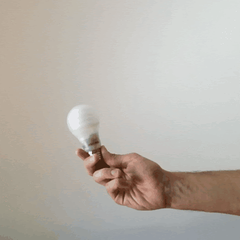
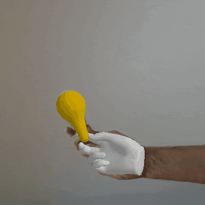
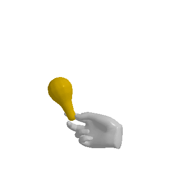

# Towards uncontrained hand-object reconstruction from RGB videos



Yana Hasson, Gül Varol, Ivan Laptev and Cordelia Schmid

- [Project page](https://hassony2.github.io/homan.html)
- [Paper](TODO)


#### Table of Content

- [Demo](#demo)
- [Setup](#setup)
  - [Environment setup](#environment-setup)
  - [External Dependencies](#external-dependencies)
  - [Download datasets](#download-datasets)
- [Running the Code](#running-the-code)
  - [Check installation](#check-installation)
  - [Start fitting](#start-fitting)
- [Acknowledgements](#acknowledgements)
- [License](#licence)

# Demo

[](https://colab.research.google.com/drive/1xAa61ZD1Ji_d6oKEQSOyR_DVAYxo-W4C?usp=sharing)

# Setup

## Environment setup

Note that you will need a reasonably recent GPU to run this code.

We recommend using a conda environment:

```bash
conda env create -f environment.yml
conda activate phosa16
```

## External Dependencies

### Detectron2, NMR, FrankMocap

- Install [Detectron2](https://github.com/facebookresearch/detectron2/blob/master/INSTALL.md)

```
mkdir -p external
git clone --branch v0.2.1 https://github.com/facebookresearch/detectron2.git external/detectron2
pip install external/detectron2
```

- Install a slightly modified [fast version of Neural Mesh Renderer (NMR)](https://github.com/JiangWenPL/multiperson/tree/master/neural_renderer) (modification makes this implementation of NMR pytorch 1.6 compatible :) )
```
mkdir -p external
git clone https://github.com/hassony2/multiperson.git external/multiperson
pip install external/multiperson/neural_renderer
cd external/multiperson/sdf
pip install external/multiperson/sdf
```

- Install [FrankMocap](https://github.com/facebookresearch/frankmocap), with a slight twist to return the detected objects
from [Understanding Human Hands in Contact at Internet Scale](https://github.com/ddshan/hand_detector.d2/), Shan et al., CVPR 2020.

```
mkdir -p external
git clone https://github.com/hassony2/frankmocap.git external/frankmocap
sh scripts/install_frankmocap.sh
```

### Install MANO

<details>
  <summary> Follow the instructions below to install MANO </summary>
  <ul>
    <li>
      Go to MANO website: http://mano.is.tue.mpg.de/
    </li>
    <li>
      Create an account by clicking *Sign Up* and provide your information
    </li>
    <li>
      Download Models and Code (the downloaded file should have the format mano_v*_*.zip). Note that all code and data from this download falls under the MANO license (see http://mano.is.tue.mpg.de/license).
    </li>
    <li>
      Unzip and copy the content of the *models* folder into the extra_data/mano folder
    </li>
  </ul>
</details>

### Install SMPL-X

<details>
  <summary> Follow the instructions below to install SMPL-X </summary>
  <ul>
    <li>
      Go to SMPL-X website: https://smpl-x.is.tue.mpg.de/
    </li>
    <li>
      Create an account by clicking *Sign Up* and provide your information
    </li>
    <li>
      Go to SMPL-X download page: https://smpl-x.is.tue.mpg.de/downloads
    </li>
    <li>
      Download the v1.1 model. Note that all data from this download falls under the SMPL-X license (see https://smpl-x.is.tue.mpg.de/license).
    </li>
    <li>
      Unzip and copy the content of the *models* folder into the extra_data/smpl folder
    </li>
  </ul>
</details>

## Download datasets


#### HO-3D

Download the dataset following the instructions on the official [project webpage](https://www.tugraz.at/index.php?id=40231).

This code expects to find the ho3d root folder at
`local_data/datasets/ho3d`

#### Core50

<details>
  <summary> Follow instructions below to setup the Core50 dataset </summary>

  <ul>
    <li>Download the Object models from ShapeNetCorev2</li>
    <ul>
      <li>
        Go to https://shapenet.org and create an account
      </li>
      <li>
        Go to the <a href="https://shapenet.org/download/shapenetcore"> download ShapeNet page </a>
      </li>
      <li>
        You will need the "Archive of ShapeNetCore v2 release" (~25GB)
      </li>
      <li>
        unzip to local_data folder by <i>adapting</i> the command
      <ul>
        <li>
        unzip /path/to/ShapeNetCore.v2.zip -d local_data/datasets/ShapeNetCore.v2/
        </li>
      </ul>
      </li>
    </ul>
  </ul>

  <ul>
    <li>Download the images from <a href="https://vlomonaco.github.io/core50/"> Core50 </a></li>
    <ul>
      <li>
      You will need the <a href="bias.csr.unibo.it/maltoni/download/core50/core50_350x350.zip"> full-size_350x350_images.zip </a>
      which you can find in the <a href="https://vlomonaco.github.io/core50/index.html#download"> download section</a>
      </li>
      <li>
      unzip to local_data folder by <i>adapting</i> the command:
      <ul>
        <li>
        unzip /path/to/core50_350x350.zip -d local_data/datasets/core50/core50_350x350
        </li>
      </ul>
      </li>
    </ul>
  </ul>

</details>

# Running the Code 

## Check installation

Make sure your file structure after completing all the [Setup](#setup) steps, your file structure in the homan folder looks like this.

```sh
# Installed datasets
local_data/
  datasets/
    ho3d/
    core50/
    ShapeNetCore.v2/
    epic/
# Auxiliary data needed to run the code
extra_data/
  # MANO data files
  mano/
    MANO_RIGHT.pkl
    ...
  smpl/
    SMPLX_NEUTRAL.pkl
```

## Start fitting

###  Core50

#### Step 1

- Pre-processing images 
- Joint optimization with coarse interaction terms

```sh
python fit_vid_dataset.py --dataset core50 --optimize_object_scale 0 --result_root results/core50/step1
```

#### Step 2

- Joint optimization refinement


```sh
python fit_vid_dataset.py --dataset core50 --split test --lw_collision 0.001 --lw_contact 1 --optimize_object_scale 0 --result_root results/core50/step2 --resume results/core50/step1
```

###  HO3d

#### Step 1

- Pre-processing images 
- Joint optimization with coarse interaction terms

```sh
python fit_vid_dataset.py --dataset ho3d --split test --optimize_object_scale 0 --result_root results/ho3d/step1
```

#### Step 2

- Joint optimization refinement


```sh
python fit_vid_dataset.py --dataset ho3d --split test --lw_collision 0.001 --lw_contact 1 --optimize_object_scale 0 --result_root results/ho3d/step2 --resume results/ho3d/step1
```

# Acknowledgements

## PHOSA

The code for this project is heavily based on and influenced by
[Perceiving 3D Human-Object Spatial Arrangements from a Single Image in the Wild (PHOSA)](https://jasonyzhang.com/phosa/)] by
Jason Y. Zhang*, Sam Pepose*, Hanbyul Joo, Deva Ramanan, Jitendra Malik, and Angjoo
Kanazawa, ECCV 2020

Consider citing their work !

```bash
@InProceedings{zhang2020phosa,
    title = {Perceiving 3D Human-Object Spatial Arrangements from a Single Image in the Wild},
    author = {Zhang, Jason Y. and Pepose, Sam and Joo, Hanbyul and Ramanan, Deva and Malik, Jitendra and Kanazawa, Angjoo},
    booktitle = {European Conference on Computer Vision (ECCV)},
    year = {2020},
}
```

## Funding

This work was funded in part by the MSR-Inria joint lab, the French government
under management of Agence Nationale de la Recherche as
part of the ”Investissements d’avenir” program, reference
ANR19-P3IA-0001 (PRAIRIE 3IA Institute) and by Louis
Vuitton ENS Chair on Artificial Intelligence.

## Other references

If you find this work interesting, you will certainly be also interested in the following publication:
- [Reconstructing Hand-Object Interactions in the Wild](https://people.eecs.berkeley.edu/~zhecao/rhoi/), [Cao](https://people.eecs.berkeley.edu/~zhecao/) et al, ICCV 2021

To keep track of recent publications take a look at [awesome-hand-pose-estimation](https://github.com/xinghaochen/awesome-hand-pose-estimation/) by 
Xinghao Chen.

## License

Note that our code depends on other libraries,
including SMPL, SMPL-X, MANO which each have their own respective licenses that must also be
followed.
